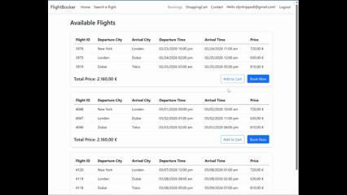

  

# ASP.NET Core MVC Flight Booking System

## Project Overview

This is an educational web application developed using ASP.NET Core MVC. This mock flight booking system simulates real-world airline reservation functionality, including multi-city flight searches, layover management, and complete booking workflows.

## Architecture \& Design Patterns

Key architectural patterns and development practices:

* **Model-View-Controller (MVC) Architecture**: Clear separation of concerns between data models, business logic, and presentation layers
* **Multi-layered Architecture**: Distinct layers for frontend presentation and database interaction through Data Access Objects (DAOs)
* **View Models**: Careful curation and transformation of database entities to optimize data transfer between layers and ensure data security
* **Dependency Injection**: Efficient service registration and dependency management for loose coupling and testability

## Core Features \& Components

### Flight Management System

The flight generation system ensures comprehensive coverage with at least one daily arrival in each of the eight supported cities. A separate DatabaseFiller project handles flight schedule generation.

The system takes a random arrival time for each city and picks a random departing city. It then looks up which connecting flights are necessary in a route table, creating each flight with 3 hours between segments for layover connections.

### Flight Search Engine

Every combination of cities has a route ID. Flights are created with a predetermined route ID and journey ID. This tracks if a flight is part of a multi-leg journey requiring layovers and which flights specifically belong together. When searching, the system returns all flights of the desired route grouped by journey ID within the specified timeframe.

### User Experience Features

**Authentication \& Authorization**  
Implements ASP.NET Core Identity for secure user authentication, enabling personalized features such as booking history and shopping cart persistence.

**Shopping Cart**  
Authenticated users can add flights to their cart, modify selections, and initiate bookings either directly from search results or from saved cart items.

**Booking Management**  
The booking history feature provides comprehensive trip management:

* Status tracking (Confirmed, Cancelled, or Pending)
* Post-booking modifications including meal selection
* Cancellation functionality with time-based restrictions

**Meal Selection**  
Passengers can select and modify meal preferences for each flight segment within their journey.

**Seat Management**

* Separate inventory tracking for Economy and Business class seats
* Real-time availability checking during search and booking
* Automatic seat number assignment upon booking completion
* Prevention of overbooking through database constraints

**Personalized Promotions**  
A banner on the flight search page advertises a random city, or when a user is logged in, displays their most frequently booked destination.

## Technical Implementation

### Database Design

The application uses a normalized relational database schema designed to efficiently handle complex flight routing, user management, and booking operations. The database structure supports all business requirements while maintaining data integrity through appropriate constraints and relationships.

### Code Organization

Following clean code principles, the application maintains clear separation between controllers, services, and data access layers. This modular approach ensures maintainability, testability, and scalability.

## Technologies Used

* ASP.NET Core MVC
* C#
* Microsoft SQL Server
* ASP.NET Core Identity

## Screenshots

!\[Search page](https://github.com/TrippasStijnGH/FlightBookerOpen/blob/main/DisplayGifs/Search.png)

